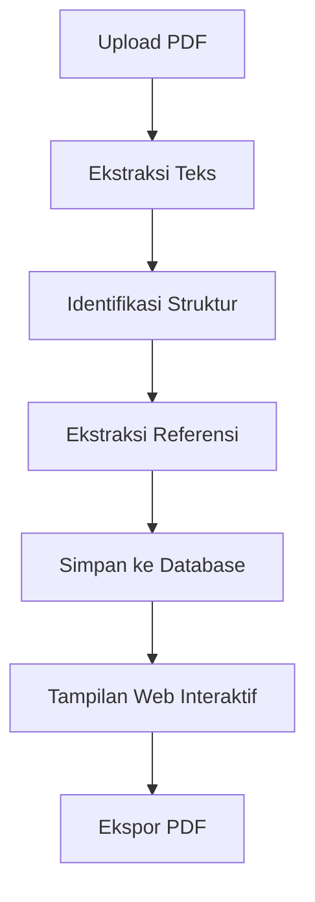

# Lintas Pasal

Aplikasi web untuk mengonversi dokumen peraturan hukum (PDF) menjadi format digital yang lebih mudah dijelajahi dan dipahami.

## Gambaran Umum

Lintas Pasal mentransformasi dokumen peraturan hukum dari format PDF statis menjadi ensiklopedia digital interaktif berbasis web. Aplikasi ini dirancang dengan tujuan:

• **Mempercepat pemahaman** peraturan kompleks melalui struktur navigasi yang intuitif  
• **Memungkinkan navigasi referensi silang** dengan satu klik untuk melacak hubungan antar pasal dan lampiran  
• **Menyajikan penjelasan istilah** secara instan melalui tooltip dan tautan eksternal  

### Masalah yang Dipecahkan

*"Pembaca sering kesulitan melacak referensi internal dalam dokumen hukum yang mengharuskan navigasi bolak-balik ke halaman berbeda untuk memahami konteks lengkap suatu ketentuan."*

Lintas Pasal mengatasi tantangan ini dengan mengubah referensi statis menjadi hyperlink interaktif yang memungkinkan navigasi seamless antar bagian dokumen.

## Fitur Saat Ini

- Upload file PDF peraturan hukum
- Ekstraksi dan parsing teks dari PDF
- Tampilan web yang terstruktur dan mudah dibaca
- Download file asli
- Manajemen file yang telah diupload

## Teknologi

- **Backend**: Node.js + Express.js
- **Frontend**: EJS Templates
- **PDF Processing**: pdfjs-dist
- **File Upload**: Multer
- **Database**: File system (untuk saat ini)

## Instalasi

1. Clone repository ini:
```bash
git clone <repository-url>
cd lintas-pasal
```

2. Install dependencies:
```bash
npm install
```

3. Jalankan aplikasi:
```bash
npm start
```

4. Buka browser dan akses: `http://localhost:3000`

## Development

Untuk development dapat dijalankan dengan auto-reload:

```bash
npm run dev
```

## Penggunaan

1. Buka halaman `/test` untuk mengakses fitur upload PDF
2. Upload file PDF peraturan hukum (maksimal 10MB)
3. Pilih "Upload Saja" untuk menyimpan file atau "Upload & Parse" untuk mengekstrak teks
4. Lihat hasil parsing dan download file jika diperlukan

## API Endpoints

- `POST /api/upload` - Upload file PDF
- `POST /api/parse/:filename` - Parse PDF yang sudah diupload
- `GET /api/files` - Daftar file yang sudah diupload
- `GET /api/download/:filename` - Download file asli
- `GET /api/view/:filename` - Lihat hasil parsing

## Struktur Project

```
lintas-pasal/
├── app.js              # Main application
├── package.json        # Dependencies dan scripts
├── bin/www            # Server startup
├── routes/            # API routes
│   ├── api.js         # API endpoints
│   └── index.js       # Web routes
├── views/             # EJS templates
│   ├── index.ejs      # Homepage
│   └── test.ejs       # Upload page
├── uploads/pdfs/      # Uploaded files
└── public/           # Static assets
```

## Alur Proses



## Roadmap MVP(Minimum Viable Product) dalam 3 Bulan

### 🎯 Tahap 1 - Upload dan Ekstraksi Teks (saat ini)
- [x] **Upload PDF** - Basic file upload dan storage
- [x] **Ekstraksi Teks** - PDF text extraction dengan pdfjs-dist
- [x] Web interface untuk upload dan view
- [x] Basic API endpoints

### 🔍 Tahap 2 - Identifikasi Struktur
- [ ] **Parser Struktur Dokumen & Hierarki** - Deteksi otomatis dan parsing hierarki dokumen (BAB > Bagian > Pasal > Ayat > huruf > angka) menggunakan regex
- [ ] **Handling Struktur Khusus** - Penanganan format khusus seperti tabel dan diagram

### 🔗 Tahap 3 - Ekstraksi Referensi
- [ ] **Deteksi Cross-Reference** - Identifikasi referensi menggunakan regex (Pasal X, BAB Y, Lampiran)
- [ ] **Reference Mapping** - Pemetaan referensi ke struktur dokumen
- [ ] **Backlink System** - Sistem navigasi balik ke referensi asal
- [ ] **Reference Validation** - Validasi keberadaan referensi yang dituju

### 💾 Tahap 4 - Penyimpanan ke Database
- [ ] **Skema Database** - Model data untuk dokumen, struktur, dan referensi
- [ ] **Data Migration** - Migrasi dari file system ke database
- [ ] **Indexing System** - Pengindeksan untuk pencarian cepat

### 🌐 Tahap 5 - Tampilan Web Interaktif
- [ ] **Navigation Panel** - Sidebar navigasi sesuai struktur hierarki dokumen
- [ ] **Cross-Reference Hyperlinks** - Konversi referensi menjadi hyperlink yang dapat diklik
- [ ] **Breadcrumb Navigation** - Pelacakan posisi dalam hierarki dokumen
- [ ] **Hover Preview** - Preview konten referensi saat hover seperti Wikipedia
- [ ] **External Links** - Integrasi dengan Wikipedia atau sumber visual untuk penjelasan teknis

### 📄 Tahap 6 - Export PDF Lanjutan
- [ ] **Interactive PDF Export** - Export PDF dengan cross-reference hyperlinks yang dapat diklik
- [ ] **Auto Bookmark Generation** - Daftar isi otomatis dengan bookmark navigasi PDF
- [ ] **Print Optimization** - Layout yang dioptimalkan untuk pencetakan dengan page breaks

## Roadmap Jangka Panjang *(di luar MVP 3 bulan)*

### 🚀 Fitur Lanjutan
- [ ] **Integrasi JDIH** - Koneksi dengan database peraturan nasional untuk cross-document referencing
- [ ] **Multi-format Export** - Support export ke Word, HTML dan JSON
- [ ] **OCR Integration** - Pemrosesan dokumen PDF hasil scan
- [ ] **Public API** - Interface untuk integrasi dengan sistem manajemen dokumen lainnya
- [ ] **Production Ready** - Containerization, caching dan CI/CD pipeline

## License

GPL

